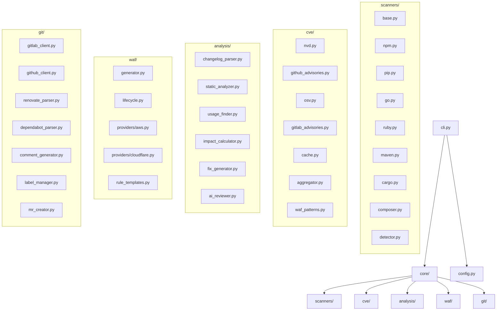
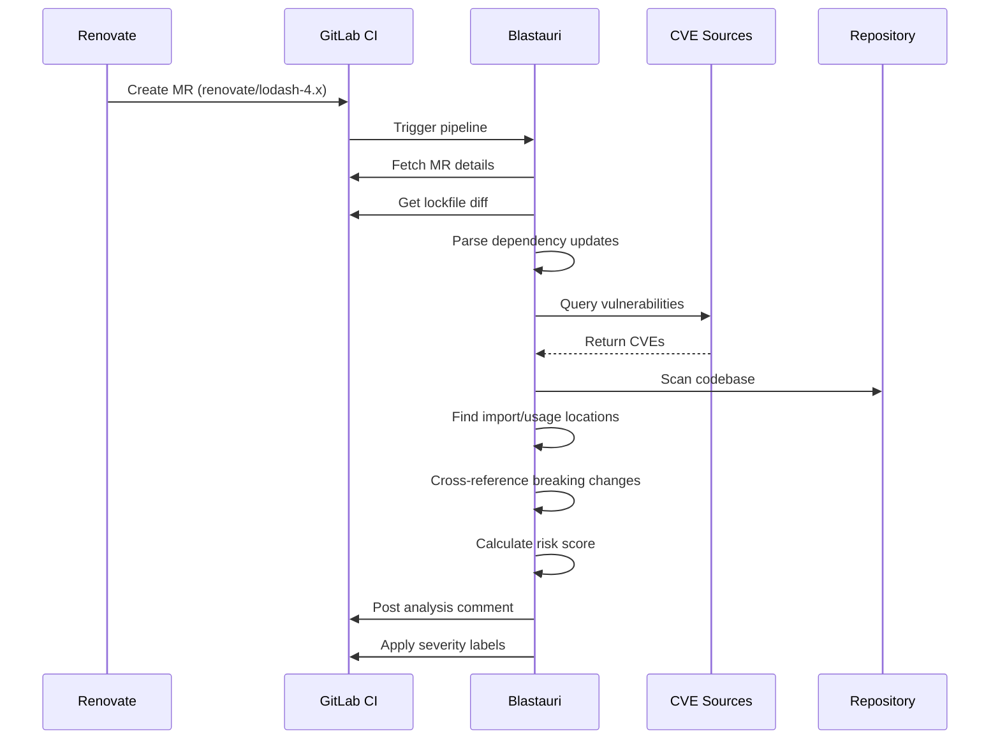
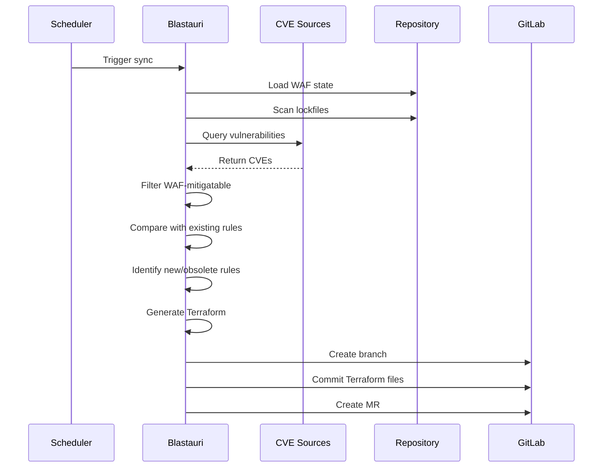
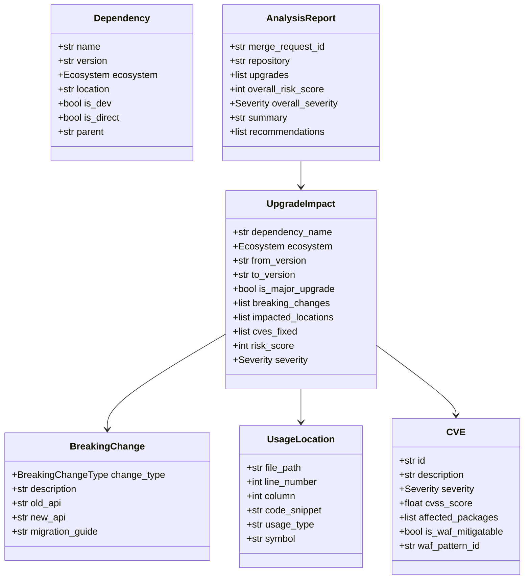
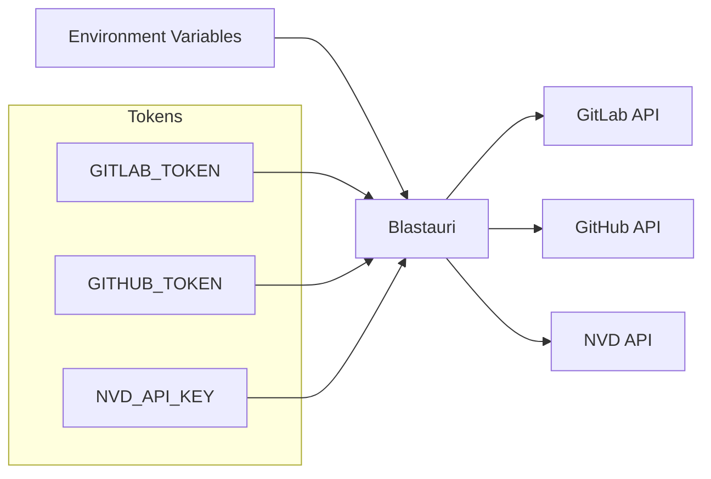
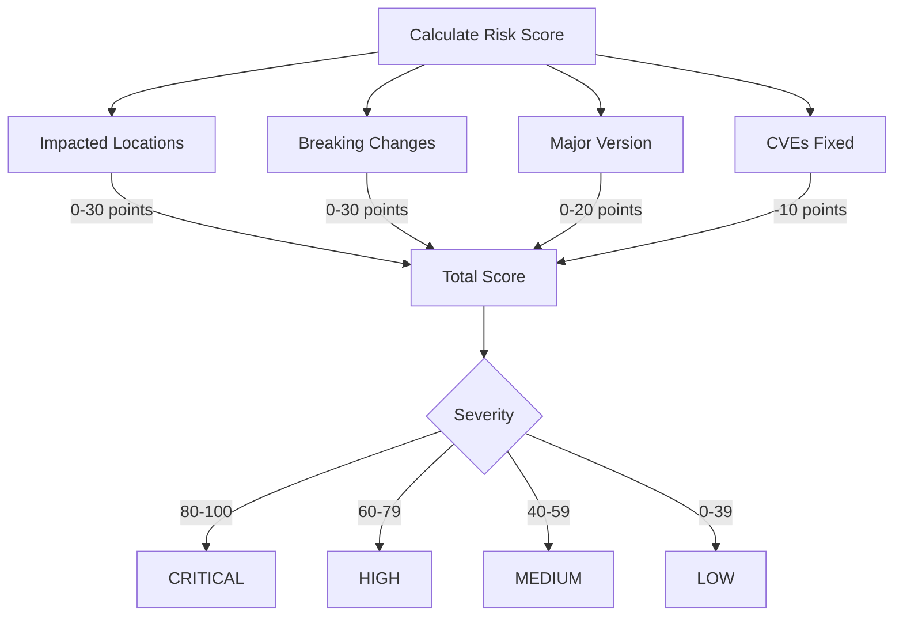
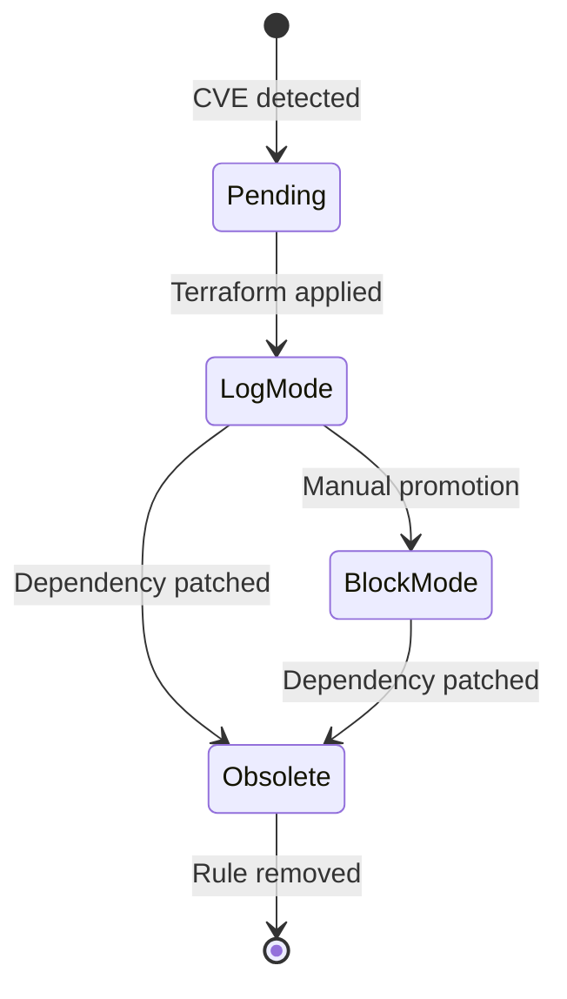
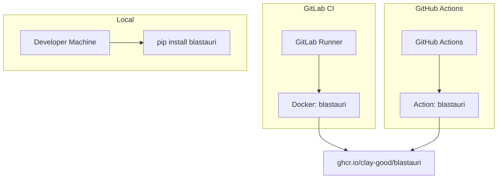

# Architecture

This document describes the system architecture of Blastauri.

## System Overview

Blastauri operates in two modes:

1. **Renovate MR Analysis** - Triggered by merge request pipelines
2. **WAF Rule Management** - Triggered by schedule or manual invocation

```mermaid
graph TB
    subgraph "Mode 1: MR Analysis"
        R[Renovate creates MR] --> T[GitLab CI triggers blastauri]
        T --> P[Parse MR diff]
        P --> Q[Query CVE databases]
        Q --> S[Static analysis]
        S --> I[Impact report]
        I --> L[Apply labels]
        L --> C[Post comment]
    end

    subgraph "Mode 2: WAF Management"
        SCH[Scheduled pipeline] --> SCAN[Scan lockfiles]
        SCAN --> CVE[Query CVE databases]
        CVE --> FILTER[Filter WAF-mitigatable]
        FILTER --> CHECK[Check existing rules]
        CHECK --> GEN[Generate Terraform]
        GEN --> MR[Create MR]
    end
```



## Component Architecture



## Data Flow

### Renovate MR Analysis Flow



### WAF Sync Flow



## Core Models



## Data Storage

Blastauri is stateless by design. Only two storage locations:

| Storage | Location | Purpose | TTL |
|---------|----------|---------|-----|
| CVE Cache | ~/.cache/blastauri/cve.db | SQLite cache for CVE queries | 24 hours |
| WAF State | .blastauri/waf-state.json | Track active WAF rules | Committed to repo |

### CVE Cache Schema

```sql
CREATE TABLE cve_cache (
    cve_id TEXT PRIMARY KEY,
    data TEXT NOT NULL,
    created_at TIMESTAMP DEFAULT CURRENT_TIMESTAMP,
    expires_at TIMESTAMP NOT NULL
);

CREATE TABLE package_queries (
    query_key TEXT PRIMARY KEY,
    cve_ids TEXT NOT NULL,
    created_at TIMESTAMP DEFAULT CURRENT_TIMESTAMP,
    expires_at TIMESTAMP NOT NULL
);
```

### WAF State Schema

```json
{
  "version": 1,
  "last_updated": "2024-01-15T10:30:00Z",
  "rules": {
    "log4shell-jndi": {
      "rule_id": "log4shell-jndi",
      "cve_ids": ["CVE-2021-44228"],
      "mode": "log",
      "created_at": "2024-01-01T00:00:00Z",
      "trigger": {
        "package": "org.apache.logging.log4j:log4j-core",
        "version": "2.14.1",
        "ecosystem": "maven"
      }
    }
  }
}
```

## Security Architecture

### Input Validation

All external input is validated:

- **Repository URLs**: No file:// or other dangerous schemes
- **MR/PR IDs**: Positive integers only
- **CVE IDs**: Pattern `CVE-\d{4}-\d{4,}`
- **File paths**: Sanitized for directory traversal
- **Dependency names**: Ecosystem-specific patterns

### Authentication



### Network Security

- HTTPS exclusively for all requests
- SSL certificate verification enabled
- 30-second timeout on all requests
- Retry with exponential backoff (1/2/4 seconds)
- Rate limiting respected (NVD: 5 req/30s, 50 with API key)

### Code Execution Safety

Blastauri MUST NOT:

- Execute code from scanned repositories
- Use eval(), exec(), or dynamic execution
- Run shell commands with user input
- Import code from scanned dependencies

Static analysis is performed via AST parsing only.

## Risk Score Calculation



## WAF Rule Lifecycle



## Deployment Architecture



## Supported Ecosystems

| Ecosystem | Lockfiles | Parser |
|-----------|-----------|--------|
| npm | package-lock.json, yarn.lock, pnpm-lock.yaml | JSON/YAML |
| Python | requirements.txt, Pipfile.lock, poetry.lock | Text/JSON/TOML |
| Go | go.mod, go.sum | Text |
| Ruby | Gemfile.lock | Text |
| Maven | pom.xml | XML |
| Cargo | Cargo.lock | TOML |
| Composer | composer.lock | JSON |

## CVE Sources

| Source | API | Rate Limit |
|--------|-----|------------|
| NVD | REST API 2.0 | 5/30s (50 with key) |
| GitHub Advisories | GraphQL | Token-based |
| OSV | REST | Unlimited |
| GitLab Advisories | REST | Token-based |
